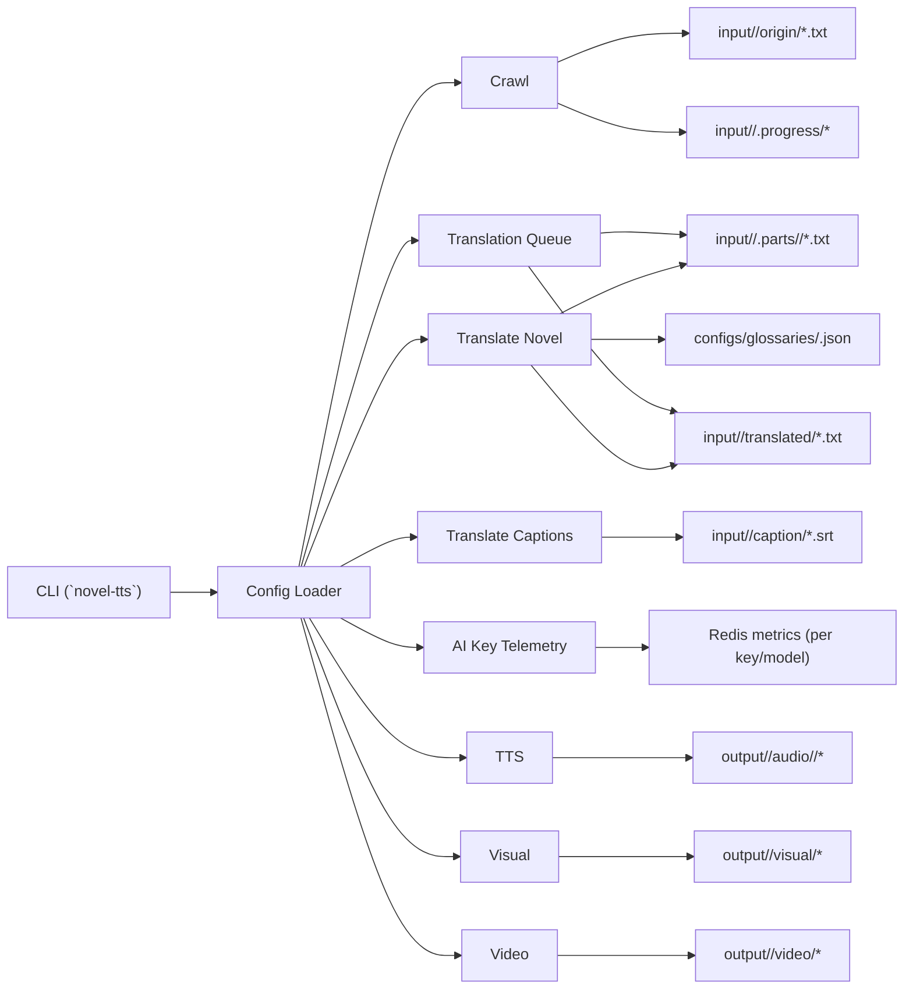
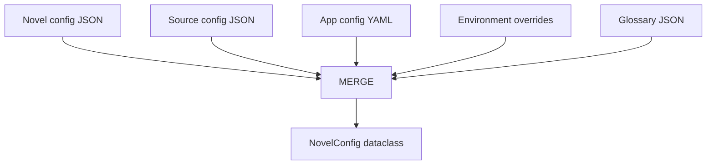
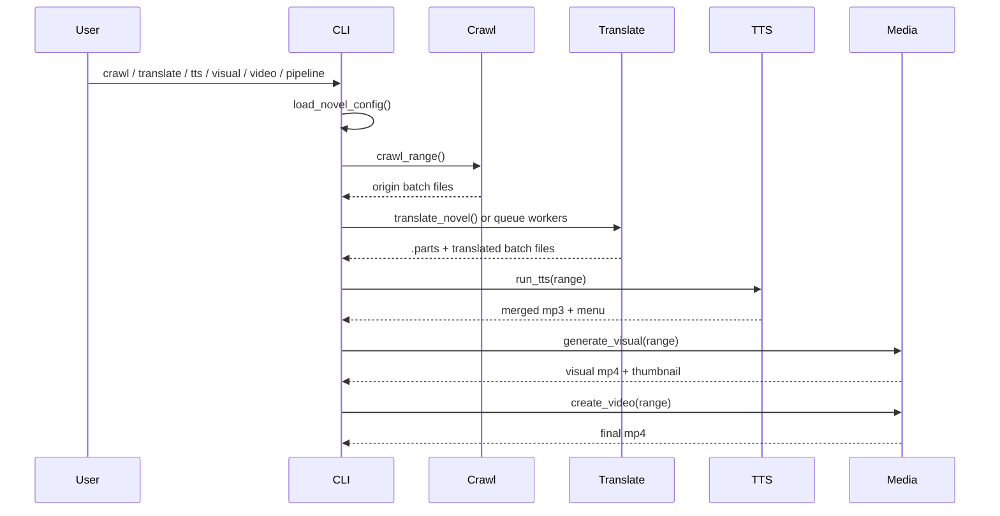
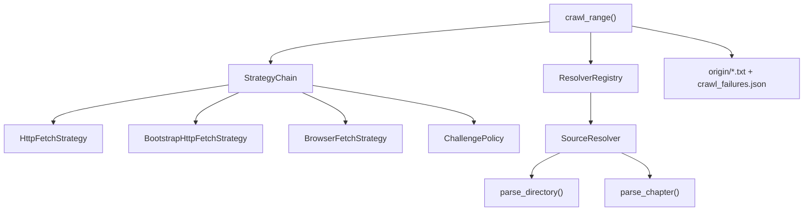
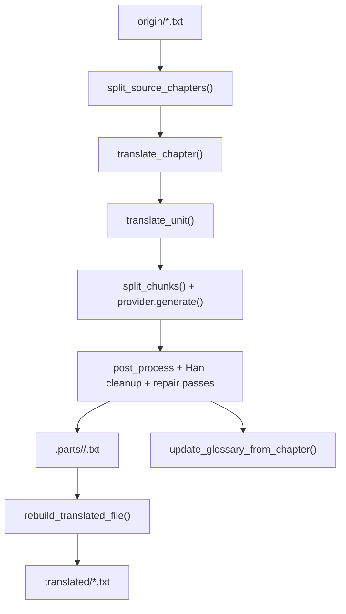
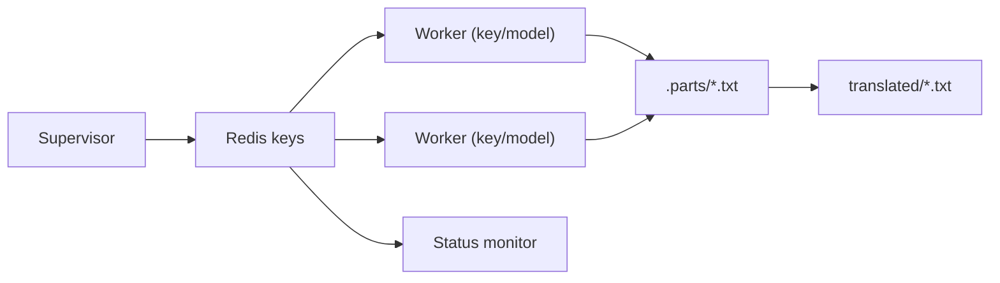
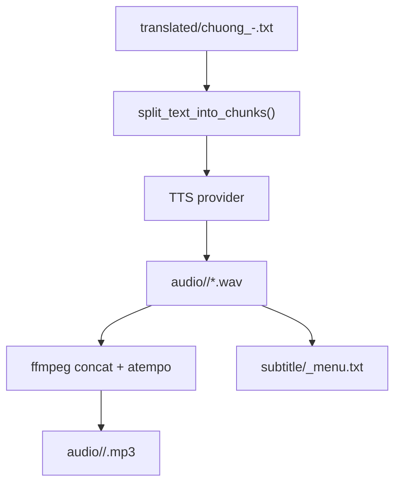
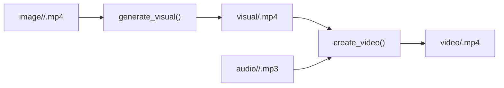

# novel-tts Architecture

## Purpose

`novel-tts` is a file-oriented CLI pipeline for turning serialized web novels into publishable audio/video assets.

At a high level it does five things:

1. Crawl chapter text from supported source sites into local batch files.
2. Translate those source batches into Vietnamese, either directly or via a Redis-backed queue.
3. Translate subtitle files separately when captions exist.
4. Generate audio from translated chapter ranges.
5. Render a visual layer and mux visual + audio into a final video.

The codebase is intentionally simple in shape:

- one Python package: `novel_tts`
- one CLI entrypoint: `novel_tts.cli.main`
- per-stage service modules instead of a large framework
- filesystem as the primary state store
- Redis only for distributed translation queueing

## System Overview

## Design Principles

- File-first processing: every stage reads files produced by the previous stage.
- Narrow module boundaries: each subsystem has a small public surface.
- Config composition over hardcoding: novel config + source config + app config are merged at runtime.
- Restartability: translation progress and crawl failures are persisted to disk.
- Operational pragmatism: browser fallback, retries, prompt repair, and glossary auto-update exist to recover from messy real-world inputs.

## Runtime Entry Points

Primary entrypoints:

- `novel_tts/__main__.py`
- `novel_tts/cli/main.py`
- console script from `pyproject.toml`: `novel-tts = "novel_tts.cli.main:main"`

Important command families:

- `crawl`
- `translate`
- `queue`
- `ai-key`
- `tts`
- `visual`
- `video`
- `pipeline`

The CLI is thin by design. It parses arguments, resolves the novel config once, chooses a log target, and dispatches into a stage service.

## Configuration Architecture

### Sources of configuration

Configuration is assembled by `novel_tts.config.loader.load_novel_config()` from:

- `configs/novels/<novel_id>.json`
- `configs/sources/<source_id>.json`
- `configs/app.yaml`
- `configs/glossaries/<novel_id>.json` or explicit glossary file
- selected environment variables

### Merge model

Key merge behavior:

- `crawl`: source defaults overridden by novel-specific crawl settings
- `browser_debug`: source defaults overridden by novel-specific browser settings
- `queue`: app defaults overridden by novel-specific queue settings
- glossary file content is sanitized before entering runtime config
- translation model can be overridden by env

Environment variables that materially affect behavior:

- Model selection:
  - `NOVEL_TTS_TRANSLATION_MODEL` (or `NOVEL_TTS_TRANSLATE_MODEL`, or `GEMINI_MODEL`)
  - `NOVEL_TTS_CAPTIONS_MODEL` (or `CAPTIONS_MODEL`)
- Provider auth:
  - `GEMINI_API_KEY`
  - `OPENAI_API_KEY`
- Translation chunking / repair switches:
  - `CHUNK_MAX_LEN`
  - `CHUNK_SLEEP_SECONDS`
  - `REPAIR_MODE`
  - `NOVEL_TTS_REPAIR_CHUNK_MAX_LEN`
  - `NOVEL_TTS_GLOSSARY_STRICT`
- Crawl/session:
  - `NOVEL_TTS_COOKIE_HEADER`
- Quota/rate-limit behavior (direct translate and queue workers):
  - `NOVEL_TTS_QUOTA_MODE` (`wait` or `raise`)
  - `NOVEL_TTS_QUOTA_MAX_WAIT_SECONDS`
  - `NOVEL_TTS_RATE_LIMIT_MAX_ATTEMPTS`
  - `NOVEL_TTS_INLINE_QUOTA_WAIT_BUDGET_SECONDS`
  - `NOVEL_TTS_HOLD_QUOTA_WAIT_BUDGET_SECONDS`
  - `NOVEL_TTS_GEMINI_TPM_CHARS_PER_TOKEN`
  - `NOVEL_TTS_GEMINI_TPM_OUTPUT_RESERVE_RATIO`
  - `NOVEL_TTS_GEMINI_TPM_OUTPUT_RESERVE_MIN`
  - `NOVEL_TTS_GEMINI_TPM_SAFETY_MULTIPLIER`
  - `NOVEL_TTS_UPSTREAM_TIMEOUT_SUGGESTED_WAIT_SECONDS`

### Typed runtime config

The merged output is a `NovelConfig` dataclass graph with these major sections:

- `storage`
- `crawl`
- `browser_debug`
- `translation`
- `captions`
- `queue`
- `tts`
- `visual`
- `video`

That dataclass graph is the main dependency passed across the system.

## Storage Layout

The project is organized around per-novel working directories.

### Input-side layout

Within `input/<novel_id>/`:

- `origin/`: source-language crawl outputs, usually batched as `chuong_<start>-<end>.txt`
- `translated/`: merged Vietnamese outputs per source batch
- `caption/`: subtitle inputs and outputs
- `.parts/`: per-chapter translated fragments, one file per chapter under each origin batch folder
- `.progress/`: resumable work state such as chunk progress and crawl failure manifests

### Output-side layout

Within `output/<novel_id>/`:

- `audio/<range>/`: wav chunks, concat file list, merged mp3
- `subtitle/`: chapter menu text files
- `visual/`: rendered overlay video and thumbnail
- `video/`: final muxed MP4

### Other operational directories

- `.logs/<novel_id>/`: per-command logs
- `tmp/`: temporary browser profiles, request artifacts, debug files
- `debug/img/`: crawl browser screenshots

## End-to-End Data Flow

## Subsystem Details

## CLI Layer

File:

- `novel_tts/cli/main.py`

Responsibilities:

- parse commands and ranges
- keep backward compatibility for `crawl <novel> ...` by rewriting argv into `crawl run ...`
- choose per-command log file (under `.logs/<novel_id>/<family>/*.log`)
- import subsystem only when needed
- convert exceptions into a process exit code (including queue-consumable rate-limit exit codes)

Notable behavior:

- `crawl run` supports `--range` or `--from/--to`
- `crawl verify` scans existing crawled files rather than fetching again
- `queue ps` / `queue ps-all` surface queue process state and progress in a pm2-like table
- `queue stop` can stop all, or a subset of, queue processes for a novel by `--pid` or `--role`
- `pipeline run` is an orchestration wrapper, not a distinct engine
- `ai-key ps` surfaces per-API-key throughput and rate-limit signals derived from Redis metrics

## Crawl Subsystem

Files:

- `novel_tts/crawl/service.py`
- `novel_tts/crawl/strategies.py`
- `novel_tts/crawl/challenge.py`
- `novel_tts/crawl/base.py`
- `novel_tts/crawl/registry.py`
- `novel_tts/crawl/resolvers/*.py`

### Responsibilities

- fetch directory pages and chapter pages
- resolve site-specific HTML structures
- detect anti-bot and rate-limit pages
- retry and switch fetch strategy when needed
- write batch source files
- track crawl failures in manifest files
- verify already-crawled content

### Crawl architecture

### Resolver model

Each supported site implements a resolver with four site-aware methods:

- `parse_directory`
- `find_directory_page_urls`
- `parse_chapter`
- `find_next_part_url`

Current resolvers:

- `SpudNovelResolver`
- `Shuba69Resolver`
- `Novel543Resolver`
- `HjwzwResolver`

This is the main extension point for adding a new source site.

### Fetch strategy model

`build_strategy_chain()` creates a strategy list based on config:

- plain HTTP first in most cases
- browser-bootstrapped HTTP when cookies from an attached Chrome session are needed
- Playwright browser fallback when challenge detection says HTTP is insufficient

`ChallengePolicy` classifies HTML/title into:

- normal
- `challenge`
- `rate_limited`

### Output semantics

`crawl_range()` writes one or more batch files into `origin/`.
Each file is named from the first and last successfully fetched chapter in that batch, not necessarily the requested range if some chapters fail.

Failure state is stored in:

- `input/<novel>/.progress/crawl_failures.json`

### Verification

`verify_crawled_content()` inspects existing origin files and reports:

- missing chapters in a file range
- duplicate chapters
- empty or suspicious content
- header mismatches
- active or stale manifest entries

This command is useful because crawl correctness depends heavily on unstable external websites.

## Translation Subsystem

Files:

- `novel_tts/translate/novel.py`
- `novel_tts/translate/providers.py`
- `novel_tts/translate/glossary.py`
- `novel_tts/translate/polish.py`
- `novel_tts/translate/captions.py`

### Responsibilities

- split source batches into chapters
- translate per chapter
- checkpoint chunk progress
- repair residual Han characters aggressively
- auto-update glossary entries
- rebuild merged translated files
- post-polish style and formatting
- translate caption SRT files separately

### Translation data model

The source of truth for chapter splitting is `config.translation.chapter_regex`.

This matters because:

- crawl output may differ by source
- queue job discovery depends on source chapter splitting
- rebuild logic assumes the same regex as chapter extraction

### Novel translation pipeline

### Why `.parts` exists

The translation stage is chapter-granular even when crawl files are batch-granular.

That gives:

- resumability
- queue distribution by chapter
- selective retranslation
- later rebuild of full translated batch files

### Translation provider abstraction

Supported providers:

- `gemini_http`
- `openai_chat`

`GeminiHttpProvider` is the more operationally important path today. It includes:

- retries
- explicit handling of 429
- prompt block detection via `promptFeedback.blockReason`

### Repair-heavy translation design

`translate_unit()` is intentionally defensive. After initial translation, it applies:

- placeholder restoration
- post replacements
- rule-based Han cleanup
- model-based final cleanup
- line-level patching
- source-vs-translation repair pass
- aggressive segmentation repair
- final forced stripping for small remaining Han residue
- a final placeholder restoration + hard fail if any `ZXQ...QXZ`/`QZX...QXZ` survive (to avoid writing poisoned `.parts`)

This is not a pure “translate once” pipeline. It is a multi-pass cleanup pipeline optimized for noisy long-form outputs.

### Glossary management

Glossary flow:

1. load and sanitize glossary at config load
2. replace glossary terms with placeholders before translation
3. restore placeholders after translation
4. optionally extract new glossary candidates from source/translation pairs
5. merge into glossary JSON under file lock

The sanitizer intentionally rejects generic terms and suspicious targets, so the glossary is biased toward reusable proper nouns and domain terms.

### Caption translation

Caption translation is separate from novel translation.

It:

- parses SRT blocks
- only translates text lines
- sends JSON-shaped prompts to the provider
- writes translated SRT back
- builds a chapter menu file if title lines exist

It does not share the full chapter translation repair stack.

### Polishing

`polish_translations()` is a post-step that rewrites already translated chapter parts using rule-based formatting and replacement heuristics.

This is especially relevant for novels with persistent naming inconsistencies.

## Queue Subsystem

File:

- `novel_tts/queue/translation_queue.py`

### Responsibilities

- discover which chapter parts still need translation
- enqueue jobs in Redis
- spawn workers per API key and model
- requeue stale inflight work
- monitor throughput and ETA

### Queue architecture

Redis keys are namespaced as:

- `<prefix>:<novel_id>:pending`
- `<prefix>:<novel_id>:queued`
- `<prefix>:<novel_id>:inflight`
- `<prefix>:<novel_id>:retries`
- `<prefix>:<novel_id>:done`

### Job model

A single queue job maps to one chapter in one origin file:

- job id format: `<file_name>::<chapter_num>`

Workers do not call translation logic directly in-process.
Instead, they spawn:

- `python -m novel_tts translate chapter ...`

That keeps worker logic simple and reuses the regular CLI path.

### Process model

`queue launch` starts:

- 1 supervisor
- 1 status monitor
- N workers per key/model, based on config

Worker count is derived from:

- `len(.secrets/gemini-keys.txt) * sum(queue.model_configs[model].worker_count for model in queue.enabled_models)`

### Operational caveats

- queue state lives in Redis, but translation truth still lives on disk
- worker success is determined by subprocess exit code
- the launch helper currently discards child stdout/stderr to `/dev/null`, while subsystem logs go through normal logger wiring when those processes run
- process restart uses `pkill -f`, so command naming consistency matters
- the supervisor reconciles worker processes against the current keys/models config (spawns missing workers; stops out-of-range key indices and excess workers if worker_count is reduced)

## AI Key Telemetry Subsystem

Files:

- `novel_tts/ai_key/service.py`

### Purpose

`ai-key ps` is an operator tool for inspecting **per-API-key health** (Gemini keys today) while the queue is running.

It is intentionally separate from queue process inspection:

- queue commands focus on *processes and job progress*
- `ai-key` focuses on *key-level throughput, rate-limit signals, and quota waits*

### Data sources

It reads:

- `.secrets/gemini-keys.txt` (to know how many keys exist, but raw keys are never printed)
- Redis connection settings from `configs/app.yaml` (`queue.redis.*`)
- Redis time (`TIME`) when available, so 1-minute windows line up with Redis

It scans Redis keys that workers/supervisor emit (ZSETs for 1-minute windows), such as:

- `...:llm:reqs` (attempts, including retries)
- `...:api:reqs` / `...:api:calls` (fallback for older emitters)
- `...:api:429` (rate limit events)
- `...:quota:reqs` (quota-wait events)

### Filters

`ai-key ps` supports selecting a subset of keys without ever printing the raw API keys:

- `--filter`: select by `kN` / `N` (1-based key index) or by `last4` of the raw key
- `--filter-raw`: select by exact raw key(s) (still never printed; only used for matching)

## TTS Subsystem

Files:

- `novel_tts/tts/service.py`
- `novel_tts/tts/providers.py`

### Responsibilities

- load translated batch text for a chapter range
- split it into chapter chunks
- synthesize audio chunk-by-chunk
- merge chunks into a single MP3
- generate a timecoded menu text file

### TTS architecture

Current provider support:

- `gradio_vie_tts`

Provider runtime dependencies:

- a reachable Gradio server URL from `configs/providers/tts_servers.json`
- model payload in `configs/providers/tts_models.json`

## Media Subsystem

File:

- `novel_tts/media/service.py`

### Responsibilities

- render overlay text on top of a background video
- extract a thumbnail
- loop the visual track to match audio duration
- mux visual + audio into final MP4

### Visual/video flow

This layer is intentionally lightweight:

- FFmpeg is the rendering engine
- there is no scene graph or timeline abstraction
- all overlay text comes from `config.visual`

## Common Utilities

Files:

- `novel_tts/common/logging.py`
- `novel_tts/common/ffmpeg.py`
- `novel_tts/common/text.py`
- `novel_tts/common/subprocesses.py`

These are thin wrappers, not a framework layer.

Key responsibilities:

- logging setup and per-novel log file location
- FFmpeg / FFprobe execution
- whitespace normalization and range parsing
- generic subprocess helper

## Important Invariants

These assumptions show up across the codebase:

- `origin/*.txt` is the source of truth for chapter discovery
- `translation.chapter_regex` must correctly match origin chapter headings
- `.parts/<batch>/<chapter>.txt` is the source of truth for per-chapter translation completion
- `translated/<batch>.txt` is a rebuild artifact, not the primary translation state
- TTS expects translated text headings to start with `Chương <n>`
- media generation expects a translated file for the exact requested range

Breaking any of these tends to create downstream failures that look unrelated.

## Extension Points

### Add a new crawl source

1. add `configs/sources/<source>.json`
2. implement a resolver in `novel_tts/crawl/resolvers/`
3. register it in `novel_tts/crawl/registry.py`
4. create or update novel configs to use the new source

### Add a new translation provider

1. implement provider class in `novel_tts/translate/providers.py`
2. update provider factory
3. ensure prompt/response contract matches current call sites

### Add a new TTS provider

1. implement provider in `novel_tts/tts/providers.py`
2. update factory logic
3. ensure return shape is compatible with `run_tts()`

### Add a new pipeline stage

If a stage is user-facing:

1. expose it from a service module
2. dispatch it from CLI
3. decide which directory becomes its persistent artifact boundary

## Operational Notes

- Crawl is the least deterministic subsystem because it depends on third-party sites and anti-bot behavior.
- Translation is the heaviest logic subsystem because it combines provider calls, resumability, glossary evolution, and aggressive cleanup.
- Queue is operational glue rather than a separate translation engine.
- TTS and media are straightforward wrappers around external tools and services.
- The project currently has little visible automated test coverage; architecture understanding matters because many failures are integration failures rather than unit-level bugs.

## Practical Debugging Guide

When something goes wrong, start from the artifact boundary nearest the failure:

- crawl issue: inspect `origin/`, `.progress/crawl_failures.json`, and browser screenshots in `debug/img/`
- translation issue: inspect `.parts/`, `.progress/*.json`, glossary file, and translated batch rebuild
- queue issue: inspect Redis key counts, `.logs/<novel>/queue/*.log`, and missing part files
- TTS issue: inspect translated range file, generated wavs, and concat list
- media issue: inspect background asset, generated visual mp4, and ffmpeg availability

That debugging style matches how the system is built.
