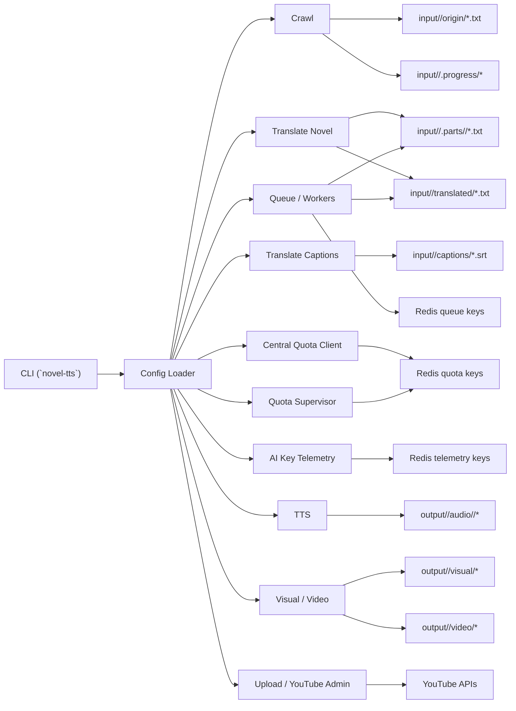
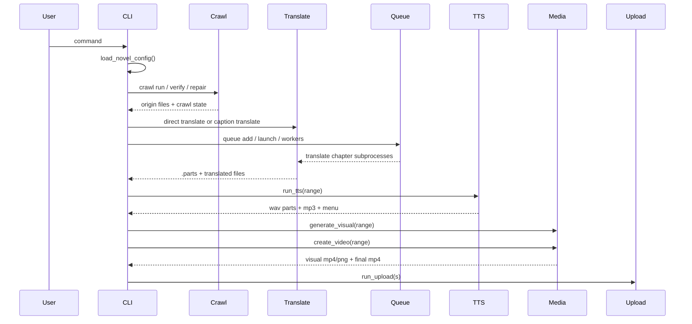

# novel-tts Architecture

## Purpose

`novel-tts` is a file-first Python CLI for turning serialized web novels into Vietnamese audio and video deliverables.

Today the repo supports these major flows:

1. Crawl source chapters from supported sites into local batch files.
2. Translate crawled batches chapter-by-chapter into Vietnamese.
3. Optionally translate captions (`.srt`) as a separate input stream.
4. Coordinate distributed translation workers through Redis.
5. Coordinate shared RPM/TPM/RPD limits through a global quota supervisor.
6. Inspect per-key telemetry for Gemini usage.
7. Generate TTS audio from translated chapter ranges.
8. Render visual assets and mux final MP4 videos.
9. Upload outputs to YouTube, plus TikTok dry-run scaffolding.

The architecture stays intentionally simple:

- One package: `novel_tts`
- One CLI entrypoint: `novel_tts.cli.main`
- Mostly service-style modules, not a framework
- Filesystem as the source of truth
- Redis only for queue/quota/telemetry/runtime bookkeeping

## Core Invariants

These invariants shape most implementation choices:

- Stages communicate through files under `input/<novel_id>/` and `output/<novel_id>/`.
- `input/<novel_id>/.parts/...` is canonical translation truth.
- `input/<novel_id>/translated/*.txt` is derived and rebuildable from `.parts`.
- Queue state in Redis is disposable operational state, not business truth.
- Crawl/origin headings are usually ASCII `Chuong <n> ...`.
- Translated/TTS/media headings are usually Vietnamese `Chương <n> ...`.

Changing heading formats can break chapter splitting, translation rebuild, TTS chapter detection, subtitle menu generation, and media packaging.

## Top-Level Shape

## Runtime Entry Points

Primary entrypoints:

- `novel_tts/__main__.py`
- `novel_tts/cli/main.py`
- console script in `pyproject.toml`: `novel-tts = "novel_tts.cli.main:main"`

The CLI is intentionally thin:

- parse args
- resolve the novel config once
- choose a log file
- lazily import the stage module it needs
- convert provider quota/rate-limit exceptions into special exit codes used by queue workers

## Command Surface

Current top-level command families:

- `crawl`
- `translate`
- `queue`
- `background`
- `tts`
- `create-menu`
- `visual`
- `video`
- `upload`
- `youtube`
- `pipeline`
- `quota-supervisor`
- `ai-key`

Important subcommands:

- `crawl run`, `crawl verify`, `crawl repair`
- `translate novel`, `translate chapter`, `translate polish`, `translate captions`
- `queue launch`, `queue add`, `queue worker`, `queue supervisor`, `queue monitor`, `queue ps`, `queue ps-all`, `queue repair`, `queue requeue-untranslated-exhausted`, `queue reset-key`, `queue stop`
- `create-menu`
- `youtube playlist`, `youtube playlist update`, `youtube video`, `youtube video update`, `youtube quota`, `youtube quota capture`, `youtube quota redis`, `youtube all`
- `pipeline run`
- `pipeline watch`

Compatibility note:

- `novel-tts crawl <novel> ...` is still rewritten into `crawl run <novel> ...`.

## Configuration Architecture

Configuration is built by `novel_tts.config.loader.load_novel_config()`.

### Inputs

The loader merges:

- `configs/novels/<novel_id>.yaml`
- `configs/sources/<source_id>.json`
- `configs/app.yaml`
- `configs/glossaries/<novel_id>.json` or an explicit glossary file
- `configs/polish_replacement/common.json`
- `configs/polish_replacement/<novel_id>.json`
- selected environment variables

### Runtime Output

The merged result is a `NovelConfig` dataclass graph from `novel_tts.config.models` with these main sections:

- metadata: `novel_id`, `title`, `slug`, languages
- source wiring: `source_id`, `source`
- paths: `storage`
- crawl: `crawl` including `crawl.browser_debug`
- translation: `models`, `translation`, `captions`
- queue/runtime: `queue`, `proxy_gateway`
- downstream media: `tts`, `media` with `media.visual`, `media.video`, `media.media_batch`
- publishing: `upload`

### Merge Rules

Important current rules:

- novel config is the required root config
- source config is selected by `crawl.sources[0].source_id`
- source crawl defaults are overridden by the novel's crawl override for that source
- app-level `queue`, `tts`, `upload`, and `translation` defaults merge into per-novel overrides
- `models.*` is now the canonical shared model pool for both direct translation and queue mode
- queue model configs inherit defaults from `models.*`
- glossary JSON is sanitized before entering runtime config
- polish replacements are merged as `common` then per-novel override

### Current Translation Schema

The preferred config shape is:

- `translation`: common translation behavior
- `translation.chapter`: chapter-specific translation behavior
- `translation.captions`: caption translation behavior
- `models`: shared provider/model pool and per-model limits

Deprecated keys are actively rejected in several places, especially old translation model keys that now belong under `models`.

### Environment Variables That Matter

Commonly used runtime overrides:

- model selection:
  - `NOVEL_TTS_TRANSLATION_MODEL`
  - `GEMINI_MODEL`
- provider auth:
  - `GEMINI_API_KEY`
  - `OPENAI_API_KEY`
- direct translate fallback:
  - if `GEMINI_API_KEY` is unset, direct Gemini translation falls back to the first non-empty line in `.secrets/gemini-keys.txt`
- central quota:
  - `NOVEL_TTS_CENTRAL_QUOTA`
  - `NOVEL_TTS_CENTRAL_QUOTA_NONBLOCKING`
  - `NOVEL_TTS_CENTRAL_QUOTA_WAIT_SECONDS`
  - `NOVEL_TTS_CENTRAL_QUOTA_REQUEST_TTL_SECONDS`
  - `GEMINI_REDIS_HOST`
  - `GEMINI_REDIS_PORT`
  - `GEMINI_REDIS_DB`
- translate chunking/repair:
  - `CHUNK_MAX_LEN`
  - `CHUNK_SLEEP_SECONDS`
  - `REPAIR_MODE`
  - `REPAIR_MODEL`
  - `GLOSSARY_MODEL`
  - `NOVEL_TTS_GLOSSARY_STRICT`
- quota/rate-limit behavior:
  - `NOVEL_TTS_QUOTA_MODE`
  - `NOVEL_TTS_QUOTA_MAX_WAIT_SECONDS`
  - `NOVEL_TTS_RATE_LIMIT_MAX_ATTEMPTS`
  - `NOVEL_TTS_INLINE_QUOTA_WAIT_BUDGET_SECONDS`
  - `NOVEL_TTS_HOLD_QUOTA_WAIT_BUDGET_SECONDS`
- crawl/session:
  - `NOVEL_TTS_COOKIE_HEADER`

## Storage Layout

The project is organized around per-novel working directories.

### Input Contract

Within `input/<novel_id>/`:

- `origin/*.txt`
  - crawled source-language batch files
  - typically named `chuong_<start>-<end>.txt`
- `translated/*.txt`
  - merged Vietnamese files rebuilt from `.parts`
- `captions/*.srt`
  - caption input and translated caption output
- `.parts/<origin_stem>/<chapter>.txt`
  - canonical per-chapter translated output
- `.parts/<origin_stem>/<chapter>.sha256`
  - source hash tracking for staleness detection
- `.parts/.../*.glossary*.json`
  - glossary progress/marker artifacts
- `.progress/*`
  - resumable work state for translation and crawl
  - includes crawl failure manifests and translation chunk checkpoints
- `repair_config.yaml`
  - optional crawl-repair instructions generated from research logs

### Output Contract

Within `output/<novel_id>/`:

- `audio/<range>/`
  - final merged MP3 for the range
  - per-chapter WAV parts under `audio/<range>/.parts/`
  - per-part hash cache under `audio/<range>/.parts/.cache/`
- `subtitle/`
  - generated chapter menu text files
- `visual/`
  - rendered visual MP4 and thumbnail PNG
- `video/`
  - final muxed MP4 ready for upload
- output-side metadata files referenced by upload config
  - e.g. title, description, playlist id templates

### Other Operational Directories

- `.logs/<novel_id>/...`
  - per-command and per-worker logs
- `.logs/quota-supervisor.log`
  - shared global quota-supervisor log
- `.logs/archived/...`
  - rotated historical logs
- `tmp/`
  - prompt dumps, response dumps, browser temp artifacts
- `debug/img/`
  - crawl browser screenshots when relevant
- `image/`
  - visual background assets and channel overlays

## End-to-End Flow

## Subsystems

### CLI Layer

Primary file:

- `novel_tts/cli/main.py`

Responsibilities:

- define the full argparse tree
- normalize backward-compatible CLI shapes
- map commands to per-run log files under `.logs/`
- support watch-mode terminal UIs for `queue ps`, `queue ps-all`, and `ai-key ps`
- expose standalone `create-menu` and YouTube admin/quota commands in addition to the main pipeline stages
- provide two pipeline execution modes:
  - `per-stage`
  - `per-video`
- manage `quota-supervisor` foreground/daemon lifecycle
- convert `RateLimitExceededError` into exit code `75` or `76` for queue workers

Special exit code semantics:

- `75`: HTTP 429 / backoff style rate limit
- `76`: quota gate or upstream wait condition

### Config Layer

Primary files:

- `novel_tts/config/loader.py`
- `novel_tts/config/models.py`

Responsibilities:

- parse and validate config files
- reject deprecated config shapes
- merge app/source/novel config
- normalize shared model-pool settings
- build `StorageConfig` path helpers
- sanitize glossary content before use
- resolve upload, queue, proxy-gateway, and TTS settings into typed dataclasses

The loader also supports captions-only setups where no crawl source is configured.

### Crawl

Primary files:

- `novel_tts/crawl/service.py`
- `novel_tts/crawl/strategies.py`
- `novel_tts/crawl/challenge.py`
- `novel_tts/crawl/registry.py`
- `novel_tts/crawl/base.py`
- `novel_tts/crawl/resolvers/*.py`
- `novel_tts/crawl/repair_config.py`

### Resolver Model

Resolvers are source-specific parsers registered through `ResolverRegistry`.

They handle:

- parsing directory pages into `ChapterEntry` records
- finding additional paginated directory URLs
- parsing chapter pages into normalized chapter title/content

Current extension path:

1. add a resolver module under `novel_tts/crawl/resolvers/`
2. register it in `build_default_registry()`
3. add a source config under `configs/sources/`

### Fetch Strategy Chain

`build_strategy_chain()` assembles a layered fetch approach:

- plain HTTP fetch
- bootstrap/browser-assisted HTTP fetch
- Playwright browser fallback

The crawler uses this chain for both directory pages and chapter pages.

### Crawl Run

`crawl_range()`:

- loads the resolver and strategy chain
- fetches the directory page
- optionally follows extra directory pages until the requested range is covered
- falls back to `chapter_url_pattern` when directory parsing yields no entries
- fetches each chapter with retries and per-chapter delay
- validates content against:
  - challenge/rate-limit markers
  - very short content
  - watermark patterns
  - metadata-noise patterns
  - duplicated-content heuristics
- writes merged origin batch files into `input/<novel>/origin/`
- records failures in `input/<novel>/.progress/crawl_failures.json`

### Crawl Verify

`verify_crawled_content()` inspects saved origin files only. It does not recrawl.

It checks for issues such as:

- missing chapters
- malformed headings
- duplicate chapters
- watermark lines
- metadata noise
- stale crawl failure manifest entries

It can also sync `repair_config.yaml` from research-derived inputs.

### Crawl Repair

`repair_crawled_content()` applies targeted repairs to existing origin files.

Repair support includes:

- generating `input/<novel>/repair_config.yaml` from research logs
- inserting placeholder chapters for gaps
- replacing individual chapters from alternate sources
- removing watermark and metadata-noise lines
- deduplicating adjacent or repeated chapter content
- rewriting placeholders when chapter continuity changes

This subsystem is intentionally file-rewrite based: it repairs the batch artifacts on disk, then downstream translation can re-enqueue just the changed chapters.

### Translation

Primary files:

- `novel_tts/translate/novel.py`
- `novel_tts/translate/providers.py`
- `novel_tts/translate/model.py`
- `novel_tts/translate/glossary.py`
- `novel_tts/translate/captions.py`
- `novel_tts/translate/polish.py`
- `novel_tts/translate/repair.py`

### Chapter Translation Model

Translation is chapter-granular even when crawl inputs are batch-granular.

The core flow is:

1. split source batches into chapters
2. translate one chapter at a time
3. write each chapter into `.parts`
4. track source hash per chapter
5. optionally update glossary
6. rebuild merged `translated/*.txt`

Canonical public functions:

- `translate_novel()`
- `translate_file()`
- `translate_chapter()`
- `rebuild_translated_file()`

### Why `.parts` Is Canonical

`translate_chapter()` decides staleness chapter-by-chapter using source hashes.

That lets the system:

- skip unchanged chapters
- force-refresh a single chapter cleanly
- re-run glossary extraction without redoing every batch
- rebuild merged translated outputs deterministically

### Translation Pipeline Internals

`translate_unit()` in `novel.py` is the heavy-lifting path.

It handles:

- placeholder masking for glossary/protected terms
- chunking by configured max length
- prompt generation
- provider calls
- repair passes for residual Han text
- cleanup passes
- placeholder restoration
- optional glossary extraction from source + translated text
- checkpoint/progress files under `.progress`

This module contains a lot of operational recovery logic because real model outputs are noisy.

### Providers

Current provider implementations:

- `gemini_http`
- `openai_chat`

Provider code also contains:

- API key resolution
- per-request token estimation
- local/shared quota gating hooks
- Redis metrics emission for queue/telemetry views

### Glossary System

Glossary support is both static and dynamic.

It provides:

- sanitization of persisted glossary entries
- prompt-time glossary text generation
- glossary extraction from translated chapters
- merge-back into the on-disk glossary file
- marker/progress files to detect pending glossary work

### Caption Translation

`translate_captions()` handles SRT translation separately from chapter translation.

It:

- reads the configured input/output file names from `config.captions`
- extracts only subtitle text lines
- sends chunked JSON prompts to the translation provider
- writes translated SRT output
- generates a chapter menu text file from `Chương <n>` lines in the SRT
- optionally updates the glossary when not running inside a queue worker

### Polish Pass

`polish_translations()` performs deterministic text cleanup on translated outputs.

It handles:

- immediate repetition cleanup
- heading normalization
- title folding
- paragraph rebalance/merge logic
- exact-match replacements from `configs/polish_replacement/*.json`

### Translation Repair Queueing

`translate/repair.py` scans translated chapters for suspicious outputs and enqueues only the broken ones back into the queue.

This is a higher-level repair loop on top of crawl repair. The operator-facing CLI path for this today is `queue repair`, which calls into the translate repair scanner and then enqueues the selected jobs.

### Queue

Primary file:

- `novel_tts/queue/translation_queue.py`

The queue is chapter-based and Redis-backed, but file-truth remains on disk.

### Job Model

Current job types:

- chapter job: `<file_name>::<chapter_num>`
- captions job: `captions`

Workers ultimately run CLI subprocesses:

- `python -m novel_tts translate chapter ...`
- `python -m novel_tts translate captions ...`

### What Redis Stores

Redis is used for:

- pending queue lists
- delayed jobs
- queued set
- inflight map
- retries
- done map
- force flags
- per-model counters
- cooldown and quota-related worker state

Redis does not store completed translated text.

### Enqueue Behavior

Queue add commands operate on chapter numbers, not batch file boundaries.

Current enqueue variants:

- `queue add --range`
- `queue add --chapters`
- `queue add --repair-report`
- `queue add --all`
- `queue repair --range`
- `queue repair --all`

The queue checks whether a chapter still needs work by combining:

- missing `.parts` output
- changed source hash
- pending glossary work
- retry budget state

### Worker Behavior

`run_worker()`:

- selects an API key by key index
- optionally maps keys to proxy-gateway proxies
- respects shared cooldown and quota state
- pulls a job from Redis
- sets queue-specific env vars
- runs a translate subprocess
- reacts to special exit codes:
  - `75`: rate-limit handling and requeue cooldown logic
  - `76`: quota-gate handling and requeue or hold logic
- updates retry and done bookkeeping

Workers contain a lot of operational logic around:

- IP-ban suspicion after repeated 429s
- short inline waits for quota windows
- holding an inflight job when no idle workers exist
- delayed requeue when another key is more likely to succeed
- startup ramping to avoid burst storms

### Supervisor / Monitor

`run_supervisor()`:

- ensures the desired worker process set exists
- drains delayed jobs back to pending
- requeues stale inflight work

`run_status_monitor()`:

- writes queue state snapshots
- stays quiet while the queue is idle to reduce noise

`launch_queue_stack()`:

- optionally kills old queue processes
- clears runtime Redis state on restart
- rotates logs through the shared logrotate mechanism
- launches supervisor and monitor processes
- can optionally enqueue all pending work immediately

### Operator Views

The queue subsystem also provides operator-focused process inspection:

- `queue ps`
- `queue ps-all`
- `queue stop`
- `queue reset-key`
- `queue requeue-untranslated-exhausted`

These commands inspect the local process table plus Redis queue state to present a pm2-like operational view.

### Central Quota

Primary files:

- `novel_tts/quota/client.py`
- `novel_tts/quota/supervisor.py`
- `novel_tts/quota/eta.py`
- `novel_tts/quota/keys.py`
- `novel_tts/quota/lua_scripts.py`

This is the quota v2 coordination layer for multi-worker Gemini usage.

### Purpose

Without a central quota gate, many workers can hit the same model/key limits at once and all independently sleep or fail.

The central quota layer coordinates:

- RPM
- TPM
- RPD

across worker processes sharing the same Redis instance.

### Client

`CentralQuotaClient` reads Redis wiring from env and is enabled by `NOVEL_TTS_CENTRAL_QUOTA`.

It can:

- estimate wait time before enqueueing a request
- enqueue quota requests
- receive grants
- raise a structured `RateLimitExceededError` when work should be retried later

### Supervisor

`run_quota_supervisor()` is a separate global process.

It:

- watches quota allocation queues in Redis
- loads model limits from live novel configs
- runs Lua-based grant logic
- publishes ETA hints for queued requests
- refreshes proxy-gateway discovery state
- processes shared logrotate requests

Operationally, there should usually be one global `quota-supervisor` for the workspace, not one per novel.

### Proxy Gateway

Primary file:

- `novel_tts/net/proxy_gateway.py`

The proxy-gateway layer is optional and is mainly used by queue workers.

It supports:

- direct or socket mode
- proxy auto-discovery through a gateway service
- Redis-cached healthy proxy snapshots
- deterministic key-index to proxy assignment

Worker `k1` currently stays direct by design; higher keys can be mapped onto discovered healthy proxies.

### AI Key Telemetry

Primary file:

- `novel_tts/ai_key/service.py`

`ai-key ps` is a read-only operational view over Redis counters and configured key files.

It:

- loads `.secrets/gemini-keys.txt`
- never prints raw keys
- reads enabled models and limits from config
- reads 1-minute usage counters from Redis
- can follow live updates in a watch UI
- can filter by key index, last-4, or exact raw key input

### TTS

Primary files:

- `novel_tts/tts/service.py`
- `novel_tts/tts/providers.py`

### Input Contract

TTS reads translated files from:

- `input/<novel>/translated/*.txt`

The current splitting logic looks for `Chương <n>` headings in translated text.

### Processing

`run_tts()`:

- loads all translated batch files overlapping the requested media range
- splits it into chapter chunks
- filters those chunks to the requested range
- connects to the configured Gradio server/model
- reuses cached per-chapter WAV output when the chunk hash matches
- writes per-chapter WAV files under `output/<novel>/audio/<range>/.parts/`
- writes a merged MP3 for the range
- writes a chapter-menu text file under `output/<novel>/subtitle/`

The same module also exposes menu-only helpers:

- `create_menu()`
- `regenerate_menu()`

These back the standalone `create-menu` command and the `tts --re-generate-menu` maintenance path.

Current provider path:

- `gradio_vie_tts`

Provider config is further resolved through:

- `configs/providers/tts_servers.yaml`
- `configs/providers/tts_models.yaml`

### Media

Primary file:

- `novel_tts/media/service.py`

Current media generation is ffmpeg-driven.

### Visual Generation

Two visual paths exist:

- `generate_visual(start, end)`
  - range-based visual from a background video
- `generate_visual_for_chapter(chapter)`
  - single-chapter visual from a background cover image

The visual stage requires ffmpeg `drawtext` support and overlays:

- chapter/range labels
- configured marketing lines
- `image/channel-name.png`

Outputs:

- `output/<novel>/visual/chuong_<start>-<end>.mp4`
- `output/<novel>/visual/chuong_<start>-<end>.png`

### Final Video Mux

`create_video()`:

- reads the visual MP4
- reads the range MP3 from TTS
- loops the visual stream to the audio duration
- muxes both into `output/<novel>/video/chuong_<start>-<end>.mp4`

### Upload and YouTube Admin

Primary file:

- `novel_tts/upload/service.py`

### Upload Flow

`run_upload()` and `run_uploads()` are the publish-stage entrypoints.

Supported platforms:

- `youtube`
- `tiktok`

Current platform behavior:

- YouTube real upload is implemented
- TikTok is dry-run only; real upload is intentionally not implemented yet

### YouTube Upload

The YouTube path:

- loads OAuth credentials and cached token
- builds upload metadata from output-side title/description/playlist files
- uploads thumbnail + video
- inserts the uploaded video into the configured playlist
- retries rate-limited API operations with exponential backoff
- supports batched upload pacing between groups of uploads

### YouTube Admin Commands

The same module also backs read/update admin commands:

- list/get playlists
- update playlist metadata
- list/get videos from the authenticated channel uploads playlist
- update video metadata
- capture and read browser-derived quota sessions per YouTube project slot
- read quota summaries from shared Redis snapshots across all configured slots
- rewrite playlist-index lines in descriptions for already uploaded videos
- reorder uploaded playlist items by parsed episode number
- remove older duplicated uploads while keeping the newest copy per title

## Pipeline Orchestration

The `pipeline` commands are intentionally light orchestration, not a separate subsystem.

It can:

- crawl a range
- launch queue translation for the requested chapter range and wait until it completes
- resolve downstream media batch ranges from `media.media_batch`
- execute downstream media in one of two modes:
  - `per-stage`
  - `per-video`

This is convenience orchestration over existing services, not a distinct persistence model.

## Logging and Log Rotation

Primary files:

- `novel_tts/common/logging.py`
- `novel_tts/common/logrotate.py`

Current logging design:

- every CLI run chooses a log target automatically unless `--log-file` is provided
- novel-scoped commands log under `.logs/<novel_id>/...`
- shared commands like `youtube` and `quota-supervisor` log under `.logs/...`
- file logging uses `WatchedFileHandler` when possible so external rotation remains safe

The logrotate helper manages:

- `.logs/archived/today/`
- date-stamped archive folders
- zip archives
- background-safe rotation through file locking

Queue launch and the quota supervisor both interact with this rotation flow to keep operator logs readable.

## Common Utilities

Small shared modules in `novel_tts/common/` provide:

- `errors.py`
  - shared exceptions such as `RateLimitExceededError`
- `text.py`
  - range parsing and whitespace normalization helpers
- `ffmpeg.py`
  - ffmpeg/ffprobe wrappers
- `subprocesses.py`
  - subprocess helpers
- `logging.py` and `logrotate.py`

These utilities are deliberately small and reused across multiple stages.

## Extension Points

The main places where the architecture expects customization are:

- new crawl source:
  - add resolver + source config
- new translation provider:
  - implement provider class and register it in `get_translation_provider()`
- new TTS backend:
  - extend `novel_tts/tts/providers.py` and provider config YAML
- new upload platform:
  - extend `novel_tts/upload/service.py` and upload config models

When extending the system, preserve the file contracts first. Most of the repo assumes the on-disk layout stays stable even when runtime internals evolve.

## Practical Reading Guide

If you are onboarding to the codebase, the fastest useful read order is:

1. `README.md`
2. `docs/ARCHITECTURE.md`
3. `novel_tts/cli/main.py`
4. `novel_tts/config/loader.py`
5. one stage service you care about:
   - crawl: `novel_tts/crawl/service.py`
   - translation: `novel_tts/translate/novel.py`
   - queue: `novel_tts/queue/translation_queue.py`
   - quota: `novel_tts/quota/supervisor.py`
   - media/upload: `novel_tts/tts/service.py`, `novel_tts/media/service.py`, `novel_tts/upload/service.py`
